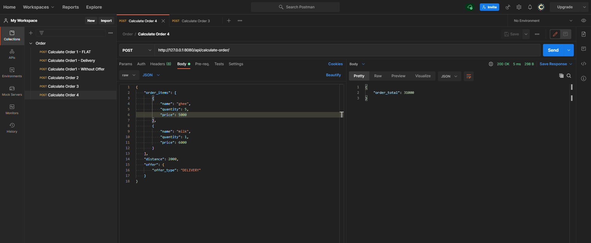

# Order_delivery
A simple order delivery API app using Python, Django, Django Rest Framework

## Features
- [x] Order Calculator
- [ ] List items
- [ ] Add to cart feature
- [ ] Save orders to database
- [ ] Order Tracking

## Usage
1. Clone this repository
```
git clone https://github.com/ShreehariVaasishta/order_delivery
```
2. Go to the root directory of this project
```
cd order_delivery
```
3. Install the dependencies using `pip`. Activate [virtual environment](https://python-guide-cn.readthedocs.io/en/latest/dev/virtualenvs.html) if you use one.
```
pip3 install -r requirements.txt
```
3. Create a `.env` file and make sure the following variables are set
```
DJANGO_SECRET_KEY
DEBUG
```
4. Start the django server 
```
./manage.py runserver
```
OR
```
python3 manage.py runserver
```
Now you should be able to access the Django app running [locally](http://127.0.0.1:8000/) at port 8000. Additionally you can specifiy the port for the django app to run in local
```
./manage.py runserver 0.0.0.0:8080
```
Now the Django app will be accessible at port 8080
## Testing
Few basic test cases are already included for the existing order calculation API which inherits Django's `TestCase` class. <br />
To run those test cases, run the following command
```
./manage.py test 
```
OR
```
python3 manage.py test
```
Test case results will be displayed in the terminal.

# Screenshots
1. With FLAT offer

2. With DELIVERY offer

3. Without OFFER

4. Order 4

5. Order 5

6. Order 6
